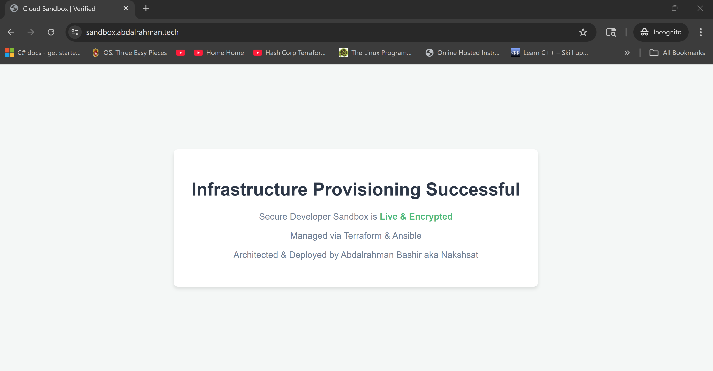
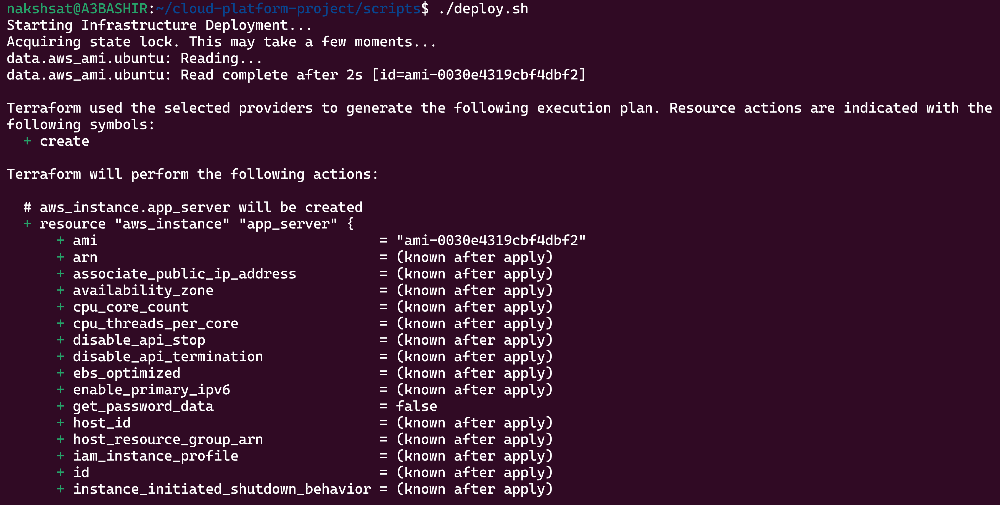
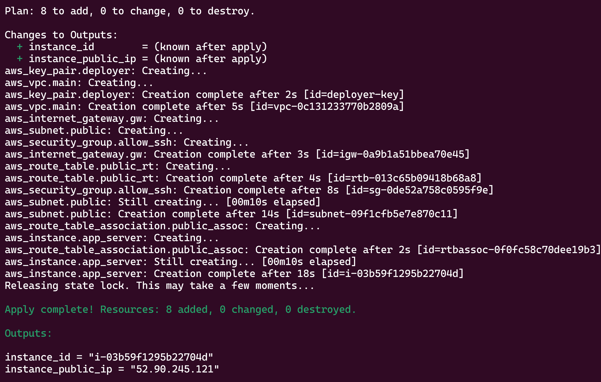
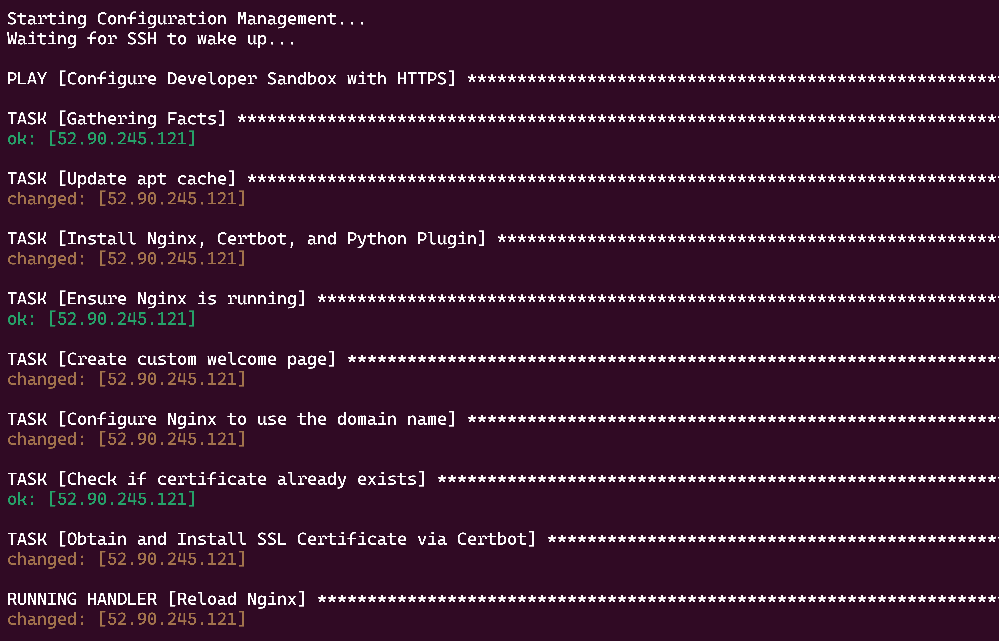
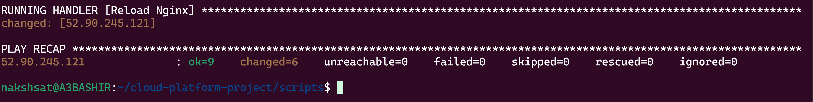

# AWS-Terraform-Ansible-Cloud-Orchestrator

This project automates the deployment and management of a web server on AWS using Terraform for infrastructure provisioning and Ansible for configuration management. The setup includes an EC2 instance running Ubuntu, Nginx web server, and SSL certificate management with Let's Encrypt.

## Project Success Screenshots


## Terraform Execution Screenshots



## Ansible Execution Screenshots



## Features
- Automated infrastructure provisioning with Terraform
- Configuration management with Ansible
- SSL certificate management via Let's Encrypt
- Custom welcome page with styling
- Easy deployment and teardown scripts

## Prerequisites
- AWS Account with appropriate permissions
- User with IAM role for EC2 management
- User with IAM role for S3 and DynamoDB (if using remote state)
- S3 bucket for Terraform state (if using remote state)
- DynamoDB table for Terraform state locking (if using remote state)
- Terraform and Ansible installed preferd on linux
- AWS CLI installed and configured with your credentials
- SSH key pair for accessing the EC2 instance
- Domain name for SSL certificate

## Setup Instructions
1. Clone the repository:
   ```bash
   git clone https://github.com/AbdalrahmanBashir/AWS-Terraform-Ansible-Cloud-Orchestrator.git
    cd aws-terraform-ansible-cloud-orchestrator
    ```
2. Update the variables in `terraform/variables.tf` as needed.

3. Set environment variables in `scripts/variables.env`:
   ```bash
   cd scripts
   cp variables.env.example variables.env
   nano scripts/variables.env
   ```

4. Run the deployment script:
   ```bash
   ./scripts/deploy.sh
   ```
5. Access your web server via the public IP or domain name.
6. To destroy the infrastructure, run:
   ```bash
   ./scripts/destroy_platform.sh
   ```
## Directory Structure
- `terraform/`: Contains Terraform configuration files.
- `ansible/`: Contains Ansible playbooks and inventory files.
- `scripts/`: Contains deployment and destruction scripts.
- `README.md`: Project documentation.
- `assets/`: Contains screenshots and other assets.
## License
This project is licensed under the MIT License.

# Authors
- Abdalrahman Bashir - Initial work
